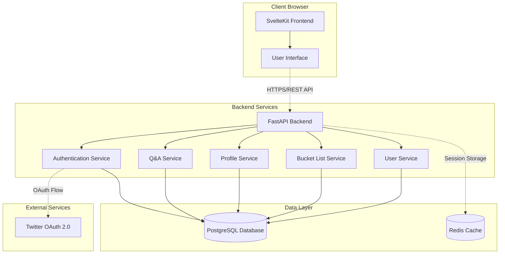
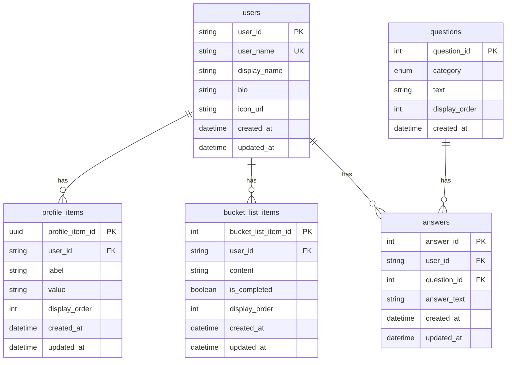
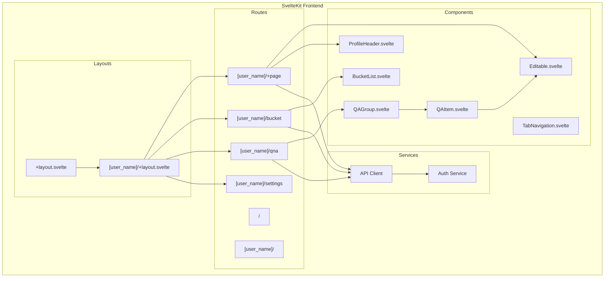
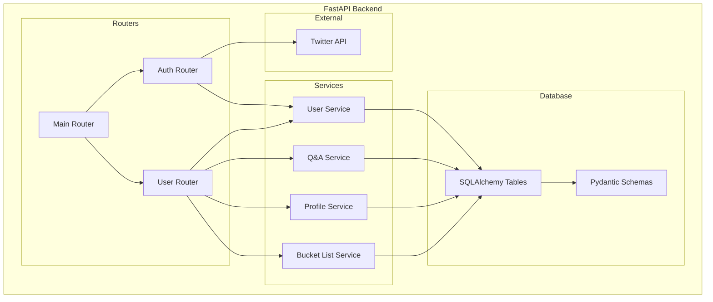
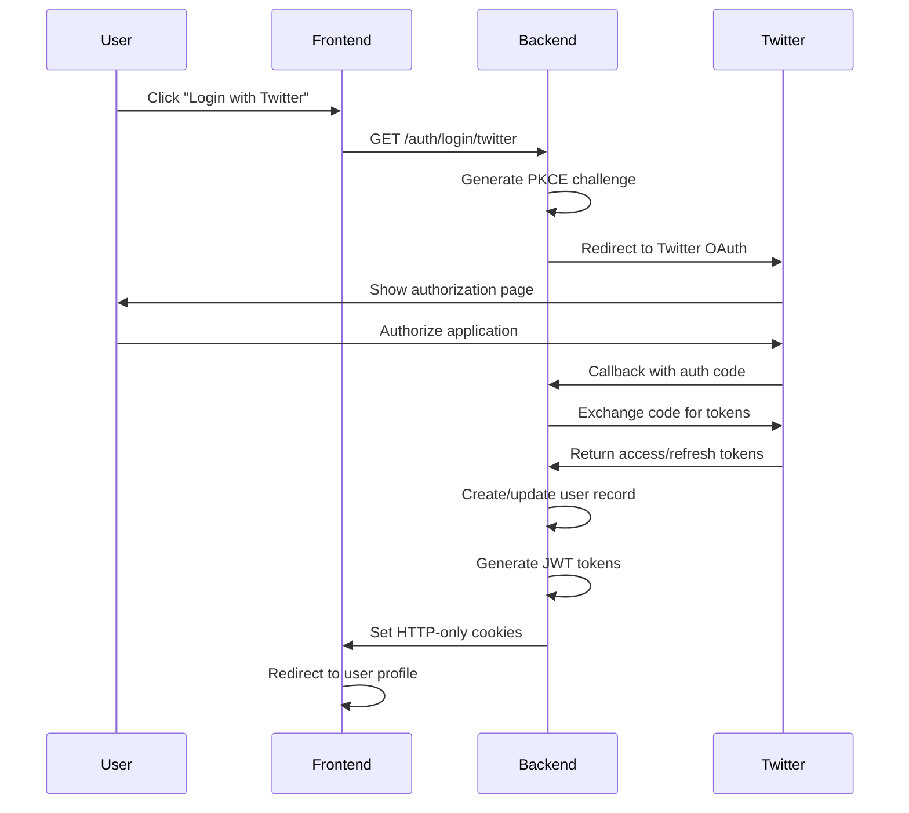
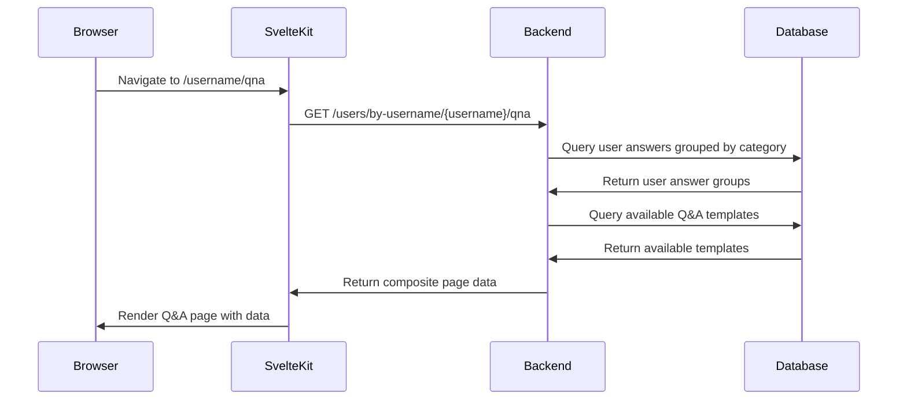
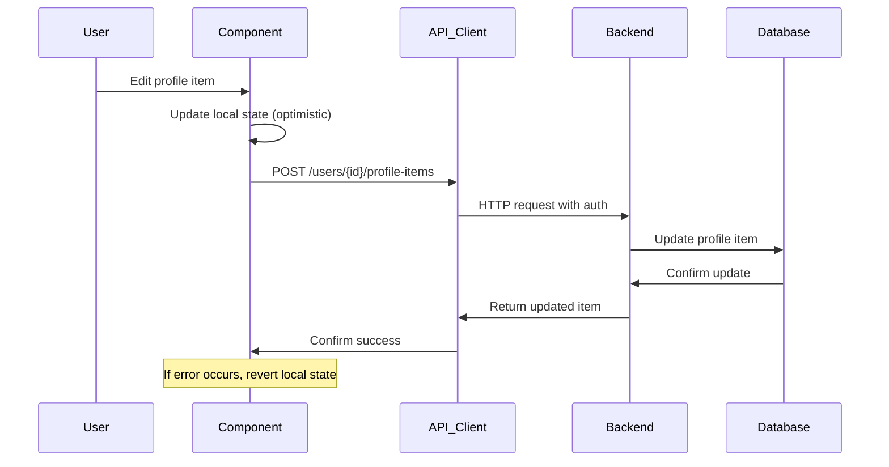
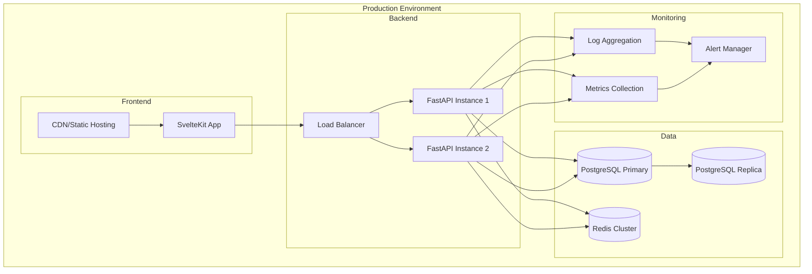

# hitoQ Architecture Documentation

## Overview

hitoQ is a social profile application that allows users to create personalized pages through Q&A responses, profile customization, and goal tracking. Built on a modern web stack with security-first design principles.

## System Architecture

## Database Schema

## Frontend Architecture

## Backend Service Architecture

## Authentication Flow

## Data Flow Patterns

### Page Loading Flow

### User Interaction Flow

## Key Features

### 1. Profile Management

- **Editable Profile Items**: Dynamic key-value pairs with drag-and-drop ordering
- **Real-time Updates**: Optimistic UI updates with backend synchronization
- **Profile Header**: User avatar, display name, and bio from Twitter

### 2. Q&A System

- **Template-based Questions**: Predefined categories (self-introduction, values, otaku, misc)
- **Answer Grouping**: Questions grouped by category with expandable UI
- **Progress Tracking**: Visual indication of answered vs. unanswered questions

### 3. Bucket List

- **Goal Tracking**: Add, edit, and mark goals as completed
- **Drag-and-Drop**: Reorder goals with visual feedback
- **Completion Status**: Toggle completion with visual indicators

### 4. Security Features

- **OAuth 2.0 with PKCE**: Secure Twitter authentication
- **JWT Tokens**: Short-lived access tokens with refresh mechanism
- **HTTP-only Cookies**: Secure token storage preventing XSS
- **CORS Protection**: Configured for production environments

## Technology Choices

### Frontend

- **SvelteKit**: Full-stack framework with SSR/SPA capabilities
- **TypeScript**: Type safety throughout the application
- **TailwindCSS**: Utility-first CSS framework
- **Svelte 5 Runes**: Modern reactivity system

### Backend

- **FastAPI**: High-performance async Python framework
- **SQLAlchemy**: ORM for database operations
- **Pydantic**: Data validation and serialization
- **Alembic**: Database migration management

### Infrastructure

- **PostgreSQL**: Primary database for relational data
- **Redis**: Session storage and caching (planned)
- **Docker**: Containerization for development and deployment

## Development Patterns

### Frontend Patterns

- **Load Functions**: Server-side data fetching for SSR
- **Optimistic Updates**: Immediate UI feedback with error handling
- **Component Composition**: Reusable components with clear interfaces
- **Type-safe API Client**: Generated types for API responses

### Backend Patterns

- **Service Layer**: Business logic separated from HTTP handlers
- **Repository Pattern**: Data access abstraction
- **Dependency Injection**: FastAPI's built-in DI system
- **Schema Validation**: Pydantic models for request/response validation

## Performance Considerations

- **Server-Side Rendering**: Fast initial page loads
- **Optimistic Updates**: Perceived performance improvements
- **Database Indexing**: Proper indexes on frequently queried columns
- **Connection Pooling**: Efficient database connection management
- **Static Asset Optimization**: Build-time optimization of CSS/JS

## Security Measures

- **Authentication**: Twitter OAuth 2.0 with PKCE
- **Authorization**: User-scoped resource access
- **Token Management**: Short-lived tokens with secure refresh
- **Input Validation**: Comprehensive request validation
- **SQL Injection Prevention**: ORM-based queries
- **XSS Prevention**: HTTP-only cookies and content security

## Deployment Architecture

## Future Enhancements

### Planned Features

- **Real-time Notifications**: WebSocket integration for live updates
- **Advanced Search**: Full-text search across user profiles
- **Social Features**: Following/followers, activity feeds
- **Content Moderation**: Automated content filtering
- **Analytics Dashboard**: User engagement metrics

### Technical Improvements

- **Caching Layer**: Redis integration for performance
- **Image Optimization**: CDN with automatic image resizing
- **API Rate Limiting**: Protection against abuse
- **Monitoring**: Comprehensive observability stack
- **Testing**: Increased test coverage and E2E testing

This architecture provides a solid foundation for a social profile application with room for growth and scalability as the user base expands.
